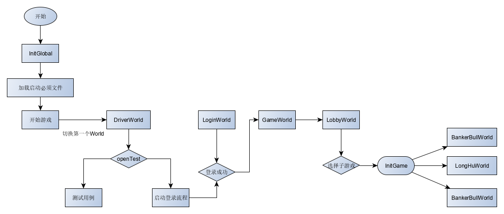

<!-- 框架阐述文档 -->

# 框架阐述
## 介绍
````text
1.基本框架采用常见的实体组件框架;
2.可以用来实现解耦，减小模块粒度；
3.如果组件设计结构和内部实现合理，可以做到像积木一样搭建出复杂灵活的功能模块。

>> 可以自行google实体组件
````
## 术语
````text
1.Entity 实体/节点
2.Part 组件/零件
3.Global 全局引用
4.World 世界/状态
5.Manager 管理器
````
## 特性
```text
1.组件组合不同的实体
2.实体的声明周期分为两种：一种是全局（Global），一种是世界（World)
```
## 配置化
```text
1.【No】不能在代码里面硬编码任何业务/抽象层/模块中层的常量
2.配置文件：Config目录下的json文件，前缀+Config.ts文件中声明变量和配置初始化逻辑接口，供业务逻辑使用
3.枚举类：可枚举的常量使用，支持遍历
4.常量类：前缀+Const.ts文件
```
## 启动流程
```text
Global.worldMgr.switchWorld 转场景，并转换World
Global.worldMgr.changeWorld 不转场景，转换World
```

# 子游戏配置
```text
子游戏配置：
1.InitGlobal.ts的getGameInitModule函数配置子游戏InitGame继承类路径
2.WorldConst.ts配置WorldConst，EnumWorldGameKind
3.继承World类，初始化entity
4.继承InitGame，从InitGame的start函数开始
```
## UI如何使用
```text
1.继承UIManager，在World的继承类中复写initUIMgr
2.UIManager的继承类构造函数中注册当前world的UI信息和名字等信息
3.UI逻辑继承BaseView，重载构造函数，传参prefab路径等信息
4.打开UI，showUI("xxx")
5.关闭UI，showUI("xxx")
6.全局UI，Global.gUIMgr
```
## BaseView特性
```text
1.构造函数传入：
    1)name 名称
    2)resPath 资源路径
    3)zIndex z值
    4)layer EnumLayer层级
2.管理子界面
    1)addSubView 子界面对应节点在主界面内
    2)createSubView 子界面节点不在主界面内，外部创建挂载
3.组件操作函数：findChild/setVisible
4.组件监听函数：addClickEvent/addEditBoxEvent/addSlideEvent/addListener
待补充
```
## Part特性
```text
1.addMessage/sendMessage 网络消息接口
2.addListener/removeListener 事件接口
3.requirePart 依赖组件接口
4.流程函数：init/initFromDict/postInit/start/onDestroy
```
## 多语言
```text
language.json 配置
配置命名规则：
[模块].[缺省的子模块].[文本英文单词]

比如：
"ec.login.error_login_game_account_online": "该账号已在其他游戏中",

ec: ErrorCode 此单词被占用，特指错误码
login: 登录模块
error_login_game_account_online: 该账号已在其他游戏中
```
```typescript
// 接口
let text: string = Global.i18n.translate("ec.login.error_login_game_account_online")
```